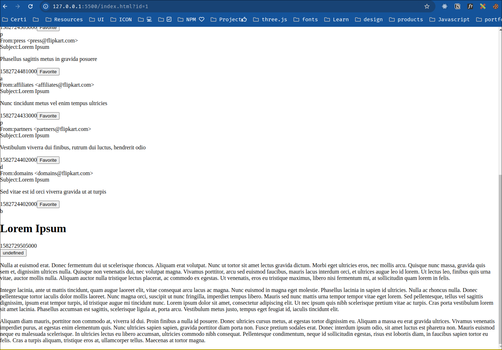
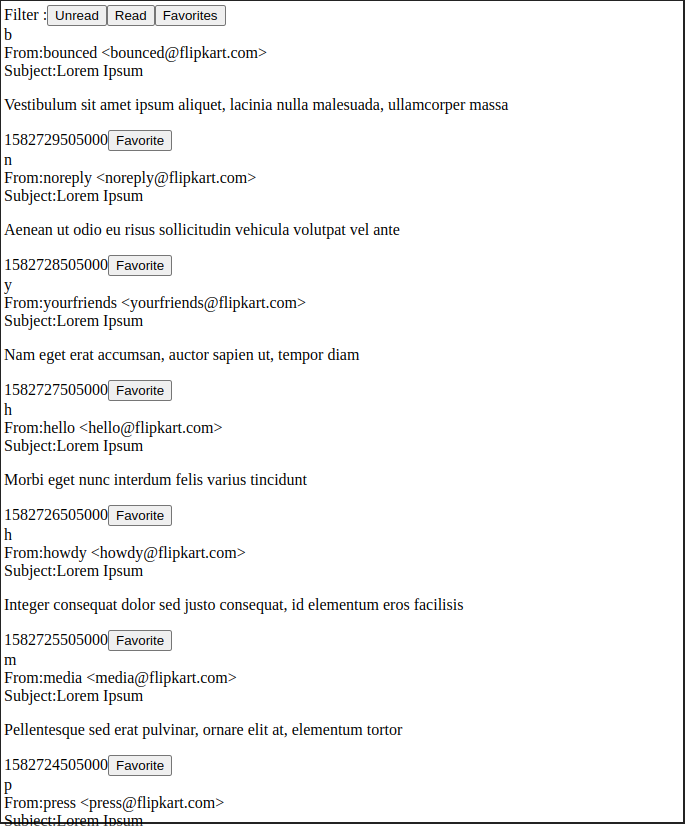

# Q1 Test

## Removing an element from the DOM

- `element.remove()`
- Reference article: https://developer.mozilla.org/en-US/docs/Web/API/Element/remove

## URLSearchParams

- Reference article: https://developer.mozilla.org/en-US/docs/Web/API/URLSearchParams

## Window: popstate event

- Reference article: https://developer.mozilla.org/en-US/docs/Web/API/Window/popstate_event

## Progress of the app

